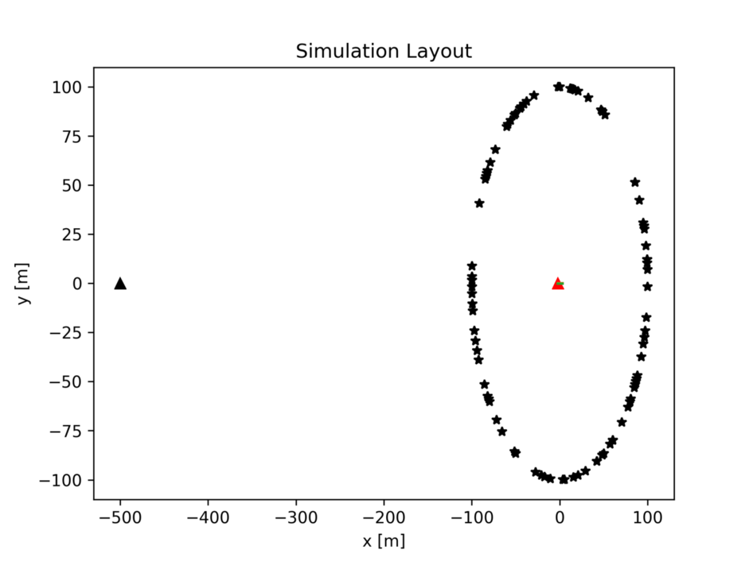
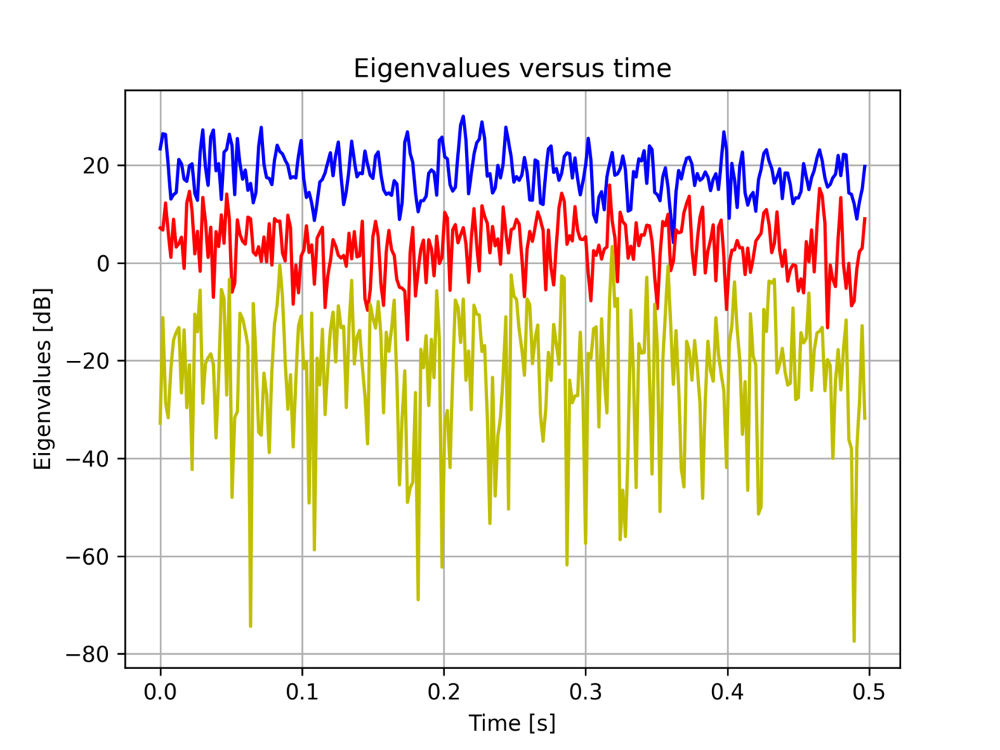
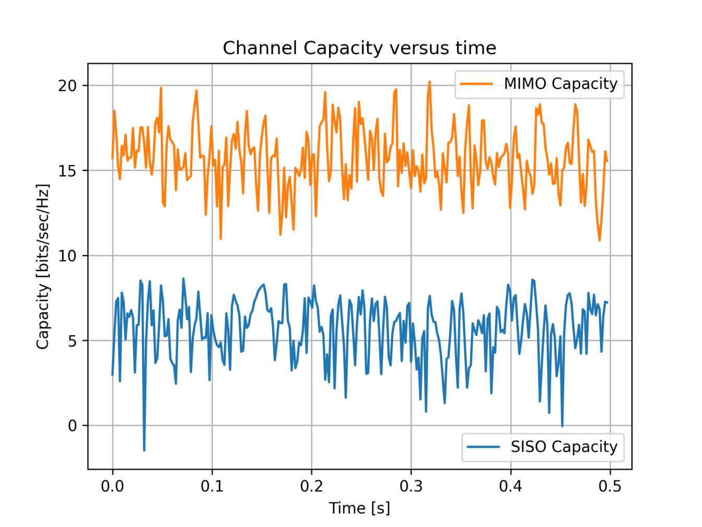

In that code the Clarke’s model is assumed. We reproduce the Clarke’s model using the multiple-scatterer approach. Clarke assumed that typical multipath conditions imply a uniform distribution of scatterers about MS. To simulate that we can set point scatterers over a circle about MS. A 3x3 MIMO scenario at 2GHz using Clarke's model is developed. Antenna arrays are allocated along y-axis with spacing = λ. The BS is assumed to be stable at [-500,0,0] (m) and the MT moves along x-axis with initial position [-2,0,0] (m), making a straight line journey of total length 5 (m) and constant velocity 10 (m/s). 100 Scatterers are randomly distributed in the 2D space (x,y) over a circle of radius 100 (m) and center [0,0]. Assuming SNR equal to 20[dB] the eigen values in [dB] and the Channel Capacity in [bits/sec/Hz] are calculated and plotted versus time. The "Uninformed Channel Capacity" approach is assumed.

